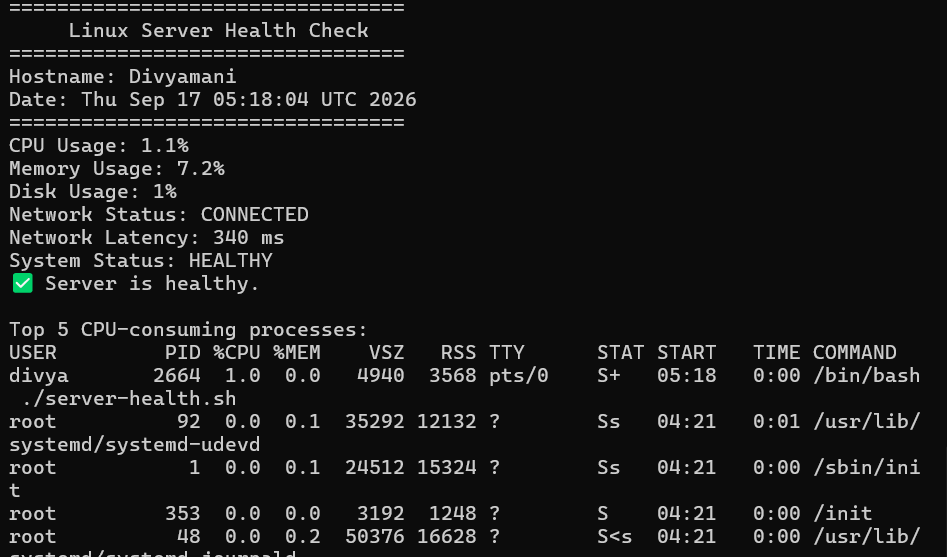
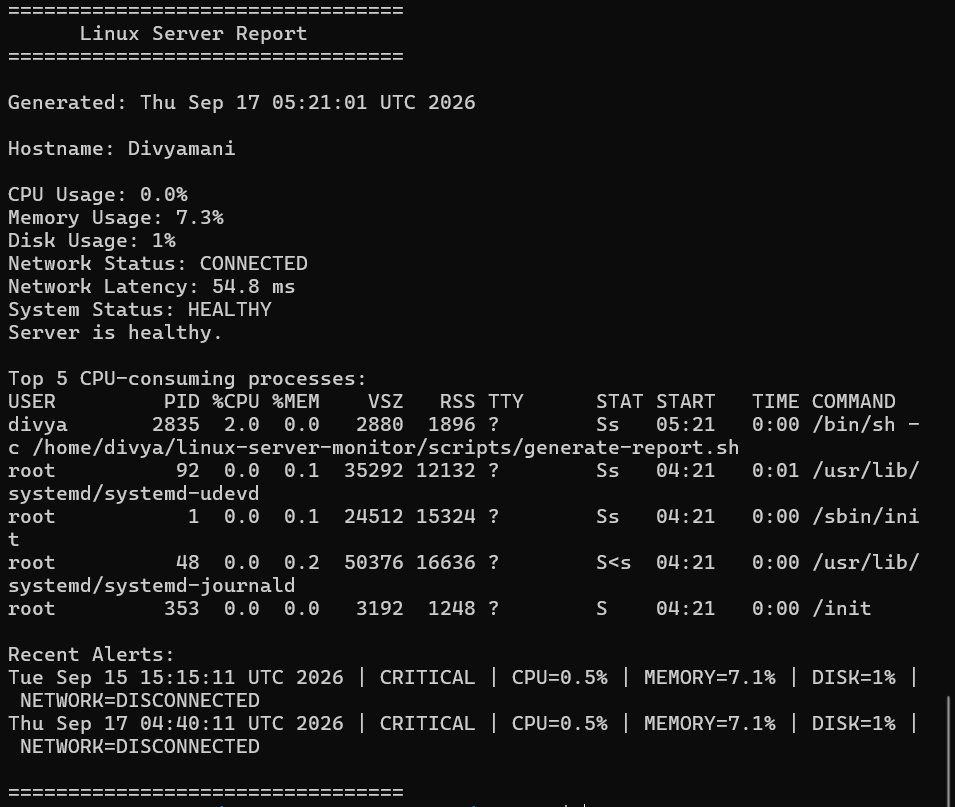
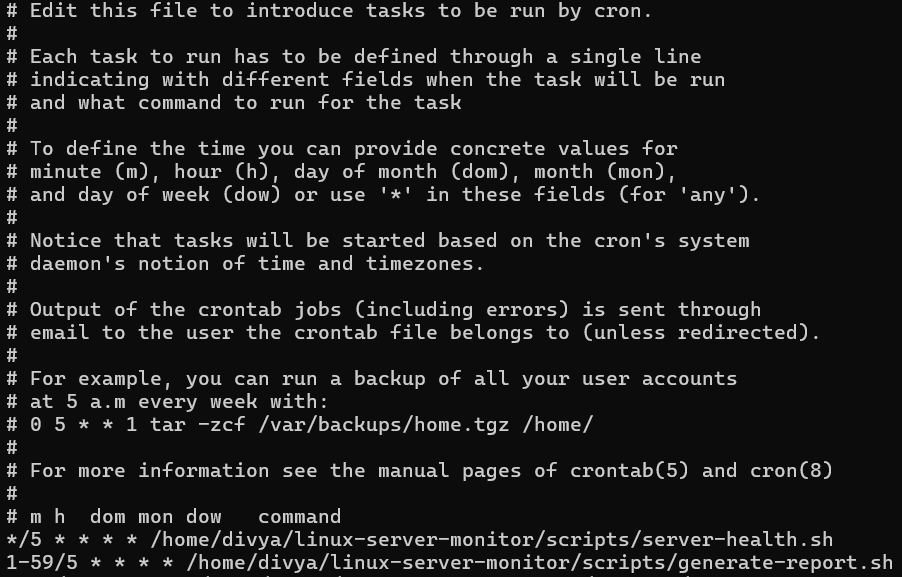

# Linux Server Monitor

A Bash-based Linux server monitoring and automation system designed to monitor essential system resources and server health.

The project collects CPU, memory, disk, and network metrics, classifies the system status, records logs and alerts, generates server reports, and creates compressed backups. It also uses Cron jobs to automate monitoring and maintenance tasks.

## Project Overview

* **System Monitoring:** Monitors CPU utilization, memory usage, disk usage, network connectivity, and network latency.
* **Health Classification:** Categorizes server health into Healthy, Warning, and Critical states using configurable thresholds.
* **Logging and Alerts:** Stores health-check information and records warning or critical events in log files.
* **Report Generation:** Generates a detailed server report containing system metrics, status, running processes, and recent alerts.
* **Backup Automation:** Creates compressed `.tar.gz`` backups of project files.
* **Task Automation:** Uses Linux Cron jobs to schedule health checks, report generation, and backups.

## Features

* CPU usage monitoring using `top`
* Memory usage monitoring using `free`
* Disk usage monitoring using `df`
* Network connectivity and latency checking using `ping`
* Detection of top CPU-consuming processes using `ps`
* Configurable warning and critical thresholds
* Healthy, Warning, and Critical status detection
* Health log and alert log maintenance
* Automated server report generation
* Compressed backup creation using `tar`
* Continuous monitoring mode
* Cron-based scheduling
* Linux shell scripting and error handling

## Tools Used

* Ubuntu Linux / WSL
* Bash Shell Scripting
* Cron
* Git and GitHub
* Linux utilities:

  * `top`
  * `free`
  * `df`
  * `ping`
  * `ps`
  * `awk`
  * `grep`
  * `tar`
  * `bc`

## Getting Started

To replicate or run this project, follow these steps.

### 1. Clone the Repository

```bash
git clone https://github.com/divya1149/linux-server-monitor.git
cd linux-server-monitor
```

### 2. Make Scripts Executable

```bash
chmod +x scripts/*.sh
```

### 3. Run a Single Health Check

```bash
./scripts/server-health.sh
```

### 4. Run Continuous Monitoring

```bash
./scripts/monitor.sh
```

Press `Ctrl + C` to stop continuous monitoring.

### 5. Generate a Server Report

```bash
./scripts/generate-report.sh
```

View the generated report:

```bash
cat reports/server-report.txt
```

### 6. Create a Backup

```bash
./scripts/backup.sh
```

## Configuration

Monitoring thresholds can be modified in:

```text
config/monitor.conf
```

Example configuration:

```bash
CPU_WARNING=70
CPU_CRITICAL=90

MEMORY_WARNING=70
MEMORY_CRITICAL=90

DISK_WARNING=70
DISK_CRITICAL=90
```

## Automation Using Cron

Cron jobs are configured to automate project tasks:

* Health checks every 5 minutes
* Report generation every 5 minutes
* Backups every 10 minutes

Example Cron configuration:

```cron
*/5 * * * * /home/divya/linux-server-monitor/scripts/server-health.sh
1-59/5 * * * * /home/divya/linux-server-monitor/scripts/generate-report.sh
2-59/10 * * * * /home/divya/linux-server-monitor/scripts/backup.sh
```

View configured Cron jobs using:

```bash
crontab -l
```

## Screenshots

### Server Health Check

This screenshot shows the monitoring script displaying CPU usage, memory usage, disk usage, network status, latency, and overall system health.



### Generated Server Report

This screenshot shows the generated server report containing system metrics, health status, top CPU-consuming processes, and recent alerts.



### Continuous Monitoring

This screenshot demonstrates the continuous monitoring script running at regular intervals.


### Cron Automation

This screenshot shows the configured Cron jobs used to automate monitoring, report generation, and backup tasks.



## Results

The project successfully:

* Monitors important Linux server resources
* Detects abnormal resource usage using configurable thresholds
* Classifies server condition into Healthy, Warning, or Critical states
* Maintains health and alert logs
* Generates readable server reports
* Creates compressed backups of project files
* Automates routine tasks using Cron scheduling

## Project Structure

```text
linux-server-monitor/
├── scripts/
│   ├── server-health.sh
│   ├── monitor.sh
│   ├── generate-report.sh
│   └── backup.sh
├── config/
│   └── monitor.conf
├── logs/
│   ├── health.log
│   └── alerts.log
├── reports/
│   └── server-report.txt
├── backups/
├── screenshots/
│   ├── health-check.png
│   ├── server-report.png
│   ├── continuous-monitor.png
│   └── cron-jobs.png
├── .gitignore
└── README.md
```

## Future Improvements

* Add an email or notification alert system
* Create a web-based monitoring dashboard
* Add Docker support
* Deploy the monitor on a cloud Linux server
* Add log rotation and automatic log cleanup
* Store monitoring data in a database
* Add graphical CPU, memory, and disk usage charts
* Integrate Prometheus and Grafana for advanced monitoring

## License

This project is currently shared for educational and portfolio purposes.

